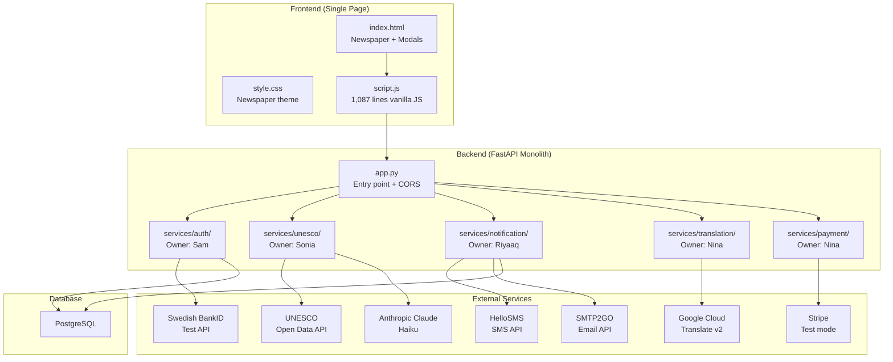
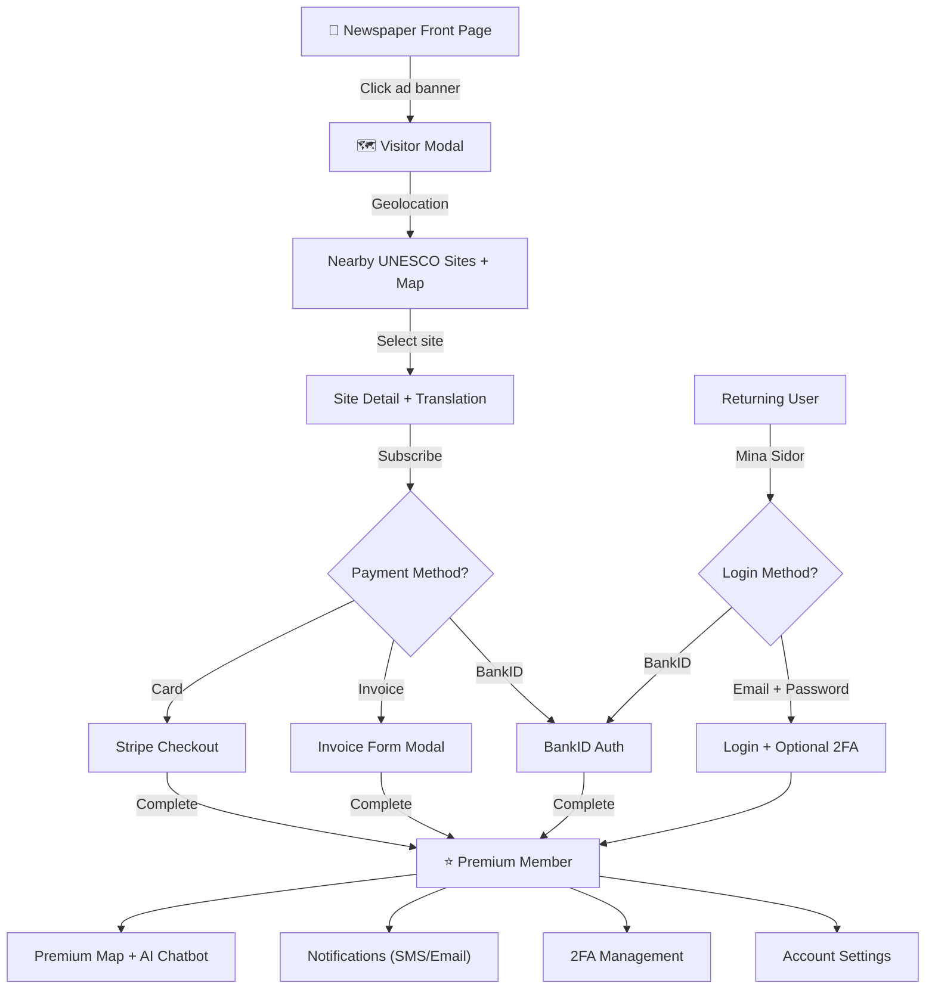

# Nordic-Digital-Solutions — Full Project Analysis

## What Is This Project?

**Nordic Digital Solutions** is a Swedish **UNESCO World Heritage discovery platform** disguised as a newspaper widget. It's embedded in a mock Swedish newspaper ("DAGSTIDNINGEN") as an ad banner that opens an interactive modal where users can:

1. **Discover** nearby UNESCO World Heritage sites via geolocation
2. **Subscribe** to a premium service (card via Stripe or invoice)
3. **Authenticate** via email/password or **Swedish BankID** (national e-ID)
4. **Receive notifications** (SMS/email) about nearby heritage sites
5. **Chat with an AI** (Anthropic Claude) about heritage sites
6. **Translate** site descriptions into 100+ languages (Google Translate)

> [!NOTE]
> This appears to be a university course project (**Utveckling av digitala tjänster** at Dalarna University / IT-Högskolan) with 5 team members, each owning a service domain.

---

## Architecture Overview



---

## Team Ownership

| Member | Service | Responsibilities |
|--------|---------|-----------------|
| **Sam** | `services/auth/` | Auth, JWT, BankID, 2FA, user management, app.py |
| **Sonia** | `services/unesco/` | UNESCO site discovery, AI chatbot |
| **Riyaaq** | `services/notification/` | SMS/email notifications, subscriber management |
| **Nina** | `services/translation/` + `services/payment/` | Google Translate, Stripe payments |
| **Amanda** | Frontend contributions | Branch work (merged) |

---

## Backend Deep-Dive

### Entry Point — [app.py](file:///C:/Users/Min%20Dator/OneDrive%20-%20IT-Högskolan%20Sverige%20AB/Documents/Dalarna/Utveckling%20av%20digitala%20tjänster/Project/Nordic-Digital-Solutions/app.py)

- **Framework**: FastAPI
- **CORS**: Configurable origins via `CORS_ORIGINS` env var
- **Static files**: Serves `frontend/static/` at `/static`
- **Routes**: `/` and `/widget` → serves `index.html`
- **Health check**: `/health` → `{"status": "ok"}`
- **Startup**: Validates BankID certificate configuration

### Core Module — `core/`

| File | Purpose |
|------|---------|
| [config.py](file:///C:/Users/Min%20Dator/OneDrive%20-%20IT-Högskolan%20Sverige%20AB/Documents/Dalarna/Utveckling%20av%20digitala%20tjänster/Project/Nordic-Digital-Solutions/core/config.py) | Pydantic settings from `.env` (DB URL, JWT secret, BankID config) |
| [database.py](file:///C:/Users/Min%20Dator/OneDrive%20-%20IT-Högskolan%20Sverige%20AB/Documents/Dalarna/Utveckling%20av%20digitala%20tjänster/Project/Nordic-Digital-Solutions/core/database.py) | SQLAlchemy engine, session factory, declarative base |
| [dependencies.py](file:///C:/Users/Min%20Dator/OneDrive%20-%20IT-Högskolan%20Sverige%20AB/Documents/Dalarna/Utveckling%20av%20digitala%20tjänster/Project/Nordic-Digital-Solutions/core/dependencies.py) | FastAPI `get_db()` dependency (yields DB session) |
| [errors.py](file:///C:/Users/Min%20Dator/OneDrive%20-%20IT-Högskolan%20Sverige%20AB/Documents/Dalarna/Utveckling%20av%20digitala%20tjänster/Project/Nordic-Digital-Solutions/core/errors.py) | HTTP error helpers (400, 401, 403, 404) |

---

### Service 1: Auth (`services/auth/`) — Sam

**Full authentication system** with dual auth paths:

````carousel
#### Email/Password Flow
```
Register (email + password + name)
        ↓
Login (email + password)
        ↓
    ┌── 2FA enabled? ──┐
    │ Yes               │ No
    ↓                   ↓
Temp token →         JWT token
6-digit TOTP code →  (done)
JWT token
```
<!-- slide -->
#### BankID Flow
```
Initiate BankID auth
        ↓
    ┌── Same device ────── Mobile ──┐
    │                               │
    Opens bankid:// URL     QR code scan
    │                               │
    └──── Poll status (2s) ────────┘
                ↓
        BankID complete
                ↓
    Find-or-create user
    (synthetic email: bankid_{pnr}@example.com)
                ↓
        JWT token
```
````

**Key files:**

| File | Lines | Purpose |
|------|-------|---------|
| [models.py](file:///C:/Users/Min%20Dator/OneDrive%20-%20IT-Högskolan%20Sverige%20AB/Documents/Dalarna/Utveckling%20av%20digitala%20tjänster/Project/Nordic-Digital-Solutions/services/auth/models.py) | 29 | `User` SQLAlchemy model (14 columns) |
| [schemas.py](file:///C:/Users/Min%20Dator/OneDrive%20-%20IT-Högskolan%20Sverige%20AB/Documents/Dalarna/Utveckling%20av%20digitala%20tjänster/Project/Nordic-Digital-Solutions/services/auth/schemas.py) | 104 | Pydantic request/response schemas |
| [security.py](file:///C:/Users/Min%20Dator/OneDrive%20-%20IT-Högskolan%20Sverige%20AB/Documents/Dalarna/Utveckling%20av%20digitala%20tjänster/Project/Nordic-Digital-Solutions/services/auth/security.py) | 109 | bcrypt, JWT, pyotp (TOTP 2FA) |
| [repository.py](file:///C:/Users/Min%20Dator/OneDrive%20-%20IT-Högskolan%20Sverige%20AB/Documents/Dalarna/Utveckling%20av%20digitala%20tjänster/Project/Nordic-Digital-Solutions/services/auth/repository.py) | 62 | Data access (user CRUD) |
| [service.py](file:///C:/Users/Min%20Dator/OneDrive%20-%20IT-Högskolan%20Sverige%20AB/Documents/Dalarna/Utveckling%20av%20digitala%20tjänster/Project/Nordic-Digital-Solutions/services/auth/service.py) | 285 | Business logic (register, login, 2FA, BankID, subscription) |
| [router.py](file:///C:/Users/Min%20Dator/OneDrive%20-%20IT-Högskolan%20Sverige%20AB/Documents/Dalarna/Utveckling%20av%20digitala%20tjänster/Project/Nordic-Digital-Solutions/services/auth/router.py) | 214 | 14 FastAPI endpoints |
| [bankid.py](file:///C:/Users/Min%20Dator/OneDrive%20-%20IT-Högskolan%20Sverige%20AB/Documents/Dalarna/Utveckling%20av%20digitala%20tjänster/Project/Nordic-Digital-Solutions/services/auth/bankid.py) | 162 | BankID mock/real integration with QR HMAC-SHA256 |

---

### Service 2: UNESCO (`services/unesco/`) — Sonia

- Fetches world heritage sites from **UNESCO Open Data API**
- **Haversine formula** for distance filtering (default 150km radius from Borlänge)
- **1-hour in-memory cache** of all sites
- **AI chatbot** via Anthropic Claude (claude-haiku-4-5-20251001) — restricted to UNESCO topics only

| Endpoint | Purpose |
|----------|---------|
| `GET /unesco/sites` | Nearby heritage sites (lat, lon, radius) |
| `POST /unesco/chat` | AI chat about heritage (premium) |

---

### Service 3: Notification (`services/notification/`) — Riyaaq

- **SMS** via HelloSMS REST API (with 3-attempt retry + exponential backoff)
- **Email** via SMTP2GO REST API (same retry logic)
- **Anti-spam cooldowns**: SMS 30 days, Email 7 days
- **Dual storage**: PostgreSQL (production) or in-memory dict (mock/fallback)
- Swedish message templates with GDPR notice

> [!IMPORTANT]
> Riyaaq's latest commit (`4449542` — "databas ändring") on the `Riyaaq` branch **removes all mock providers** and replaces in-memory storage with **SQLite**. This is **NOT yet merged to main**.

| Endpoint | Purpose |
|----------|---------|
| `POST /api/notification/send` | Send SMS or email |
| `GET /api/notification/trigger` | Location-based trigger |
| `POST /api/notification/subscribe` | Subscribe to sites |
| `POST /api/notification/unsubscribe` | Unsubscribe |
| `POST /api/notification/mark-visited` | Mark site visited |
| `GET /api/notification/subscribers` | Admin: list all (token-protected) |

---

### Service 4: Translation (`services/translation/`) — Nina

- **Google Cloud Translate v2** with 3 auth fallback methods (OAuth refresh token → OAuth browser flow → Service account → Mock)
- 100+ supported languages
- Google v3beta1-compatible endpoint for API compatibility

| Endpoint | Purpose |
|----------|---------|
| `GET /translation/languages` | List supported languages |
| `POST /translation/translate` | Translate text |
| `POST /v3beta1/projects/{id}:translateText` | v3beta1-compatible |

---

### Service 5: Payment (`services/payment/`) — Nina

- **Stripe** (test mode only — enforces `sk_test_` prefix)
- **Invoice** mock provider (in-memory, data lost on restart)
- Checkout sessions, payment intents, subscriptions

| Endpoint | Purpose |
|----------|---------|
| `POST /payment/create` | Create checkout/subscription |
| `POST /payment/cancel` | Cancel subscription |
| `GET /payment/subscription/{id}` | Get subscription status |
| `GET /payment/lyckades` | Payment success page |
| `GET /payment/avbruten` | Payment cancelled page |

---

## Frontend Deep-Dive

### Structure
```
frontend/
├── static/css/style.css        (519 lines — newspaper theme)
├── static/js/script.js         (1,087 lines — all functionality)
├── static/img/bankid-logo.svg  (BankID badge)
├── templates/index.html        (379 lines — single page)
└── testsfront/mock-data.js     (test mock data)
```

### Design System
- **Theme**: Swedish newspaper ("DAGSTIDNINGEN") with UNESCO blue accents
- **Typography**: Georgia serif (articles), Arial sans-serif (UI)
- **Colors**: `--unesco-blue: #0077d4`, `--news-red: #cc0000`, `--bankid-blue: #003087`
- **Layout**: CSS Grid (1fr + 300px sidebar), max-width 1100px
- **Responsive**: Single-column below 850px
- **External**: Leaflet.js (maps), qrcodejs (QR codes)

### User Journey


---

## Database

**Engine**: PostgreSQL (via `DATABASE_URL` env var)

### Auth Tables (SQLAlchemy + Alembic)

**`users`** table — 6 Alembic migrations:

| Column | Type | Notes |
|--------|------|-------|
| `id` | Integer PK | Auto-increment |
| `email` | String (unique) | Required |
| `hashed_password` | String | bcrypt hash |
| `full_name` | String | Optional |
| `is_active` | Boolean | Default true |
| `auth_provider` | String | "local" or "bankid" |
| `bankid_personal_number` | String (unique) | Swedish personnummer |
| `two_factor_enabled` | Boolean | TOTP 2FA |
| `two_factor_secret` | String | pyotp secret |
| `has_subscription` | Boolean | Premium status |
| `home_address` | String | Optional |
| `home_lat` / `home_lon` | Float | Home coordinates |
| `created_at` | DateTime (tz) | UTC timestamp |

### Notification Tables (raw SQL via psycopg2)

| Table | Key | Columns |
|-------|-----|---------|
| `subscribers` | `user_id` PK | phone, email |
| `subscriber_sites` | `(user_id, site_id)` PK | visited (bool) |
| `sent_log` | `(user_id, site_id, channel)` PK | sent_at (timestamp) |

---

## CI/CD

**[ci.yml](file:///C:/Users/Min%20Dator/OneDrive%20-%20IT-Högskolan%20Sverige%20AB/Documents/Dalarna/Utveckling%20av%20digitala%20tjänster/Project/Nordic-Digital-Solutions/.github/workflows/ci.yml)** — GitHub Actions:
- Triggers on push/PR to `main`
- Python 3.12 on Ubuntu
- Uses SQLite for test DB (not PostgreSQL)
- Mock mode for BankID and notifications
- Runs `pytest -q`

**Deployment**: Heroku/Railway via `Procfile` → `uvicorn app:app --host 0.0.0.0 --port $PORT`

---

## Git Branches

### ✅ Currently on: `main` (commit `9df2894`)

### Branch Status Summary

| Branch | Status | Key Changes |
|--------|--------|-------------|
| `main` | **Active** ✅ | All merged PRs up to #36 |
| `origin/Riyaaq` | **1 unmerged commit** ⚠️ | `4449542` — Replaces mock storage with SQLite, removes mock providers |
| `origin/Amandas-branch` | Fully merged | Historical contributions |
| `origin/sonias` | Fully merged | Design fixes, payment UX |
| `origin/nina-update` | Fully merged | Google Translate OAuth, auth tests |
| `Sam` / `Sam2` (local) | Has unmerged local work | Primary dev branches (BankID, auth, 2FA) |
| `feature/test-frontend2` | Has unmerged work | Testing/demo frontend (10 commits) |
| `chore/add-ci-tests` | Merged via PR #35 | CI workflow |
| `fix/bankid-premium-gate` | Merged into main | BankID + deployment fixes |
| `feature/email-2fa` | Merged into Sam | 2FA implementation |
| `feature/test-frontend` | Stale | Superseded by test-frontend2 |
| `claude/ecstatic-feynman-*` | Stale | Auto-generated, no unique work |

> [!WARNING]
> The only **actively unmerged work** on a remote branch is Riyaaq's `4449542` commit which refactors the notification DB layer from mock/PostgreSQL dual-mode to pure SQLite.

---

## Dependencies ([requirements.txt](file:///C:/Users/Min%20Dator/OneDrive%20-%20IT-Högskolan%20Sverige%20AB/Documents/Dalarna/Utveckling%20av%20digitala%20tjänster/Project/Nordic-Digital-Solutions/requirements.txt))

| Category | Packages |
|----------|----------|
| **Core** | fastapi, uvicorn, pydantic, pydantic-settings, python-dotenv |
| **Database** | sqlalchemy, psycopg2-binary, alembic |
| **Auth** | bcrypt, python-jose, python-multipart, pyotp |
| **HTTP** | requests, httpx |
| **APIs** | anthropic, google-cloud-translate, google-auth-oauthlib, stripe |
| **Testing** | pytest, pytest-mock |
| **Other** | email-validator, aiofiles, flask (possibly legacy) |
